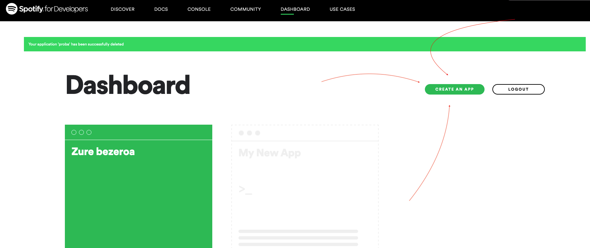
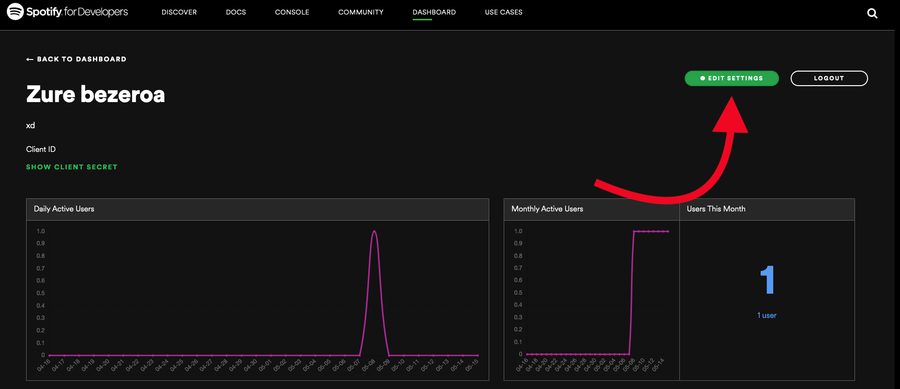
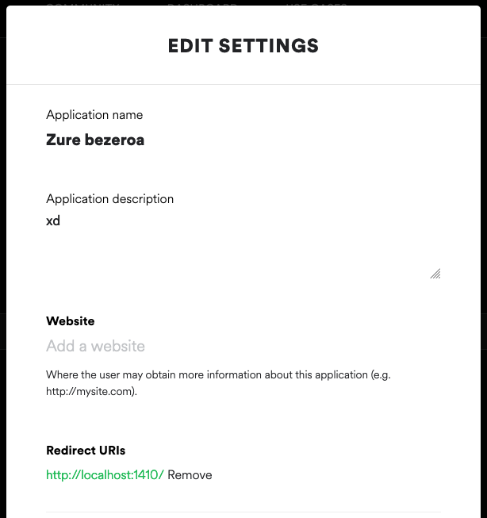

# Vanilla spotify data downloader

Para utilizar esta herramienta hace falta tener una cuenta de Spotify, y preferiblemente activa (ya que cuantas más canciones haya guardadas en la cuenta, mayor será el tamaño del conjunto de datos que se descargará).

Es necesaria una versión de python igual o superior a la 3.9.5 (para utilizar el operador  `|` entre diccionarios) lo siento :(.

Por si acaso: asegúrate de que el interpretador de python está en el `PATH` antes de intentar ejecutar el script desde la línea de comandos.
## Como preparar lo necesario

### Instalar entorno virtual y dependencias
```
python3.9 -m venv env
source env/bin/activate
python -m pip install spotipy
```

### Crear e introducir los datos del cliente de Spotify
Crea una cuenta en [Spotify for Developers](https://developer.spotify.com/dashboard/applications).

Entra en el Dasboard y pulsa el botón de CREATE AN APP.


Una vez creada la app, entra en ella y pulsa el botón de EDIT SETTINGS.


Introduce `http://localhost:1410/` en Redirect URIs.


Una vez que se ha creado la denominada APP, hay que introducir los datos relativos a ella en el documento .INI del repositorio. Los client id y secret se pueden copiar del dashboard de la APP.

### Datos del usuario de spotify

El user id y el user uri se pueden conseguir de los settings de la cuenta personal de spotify. el uri, será `spotify:user:<spotify_user_id>`.
Supongamos que tu id de spotify es `4208737b12l19a918z928e873i37987t`. Tu uri será `spotify:user:4208737b12l19a918z928e873i37987t`

### Modificar el fichero de configuración
El fichero de configuración por defecto se encuentra en `./cfg/default_dwld_cfg.INI`. Ahí podrás ver qué datos se necesitan en el perfil `DEFAULT`. 
El fichero tiene diferentes perfiles, y cada uno de ellos tiene variables que es necesario rellenar. Son cinco en total:

* `user_id`: El id de usuario de spotify de donde se descargarán los datos de su biblioteca.
* `user_uri`: El uri del mismo usuario. Cómo conseguir tu uri se describe más arriba.
* `client_id`: El id del cliente que vas a utilizar para realizar la descarga.
* `client_secret`: El secreto de ese cliente. Cómo conseguir el id y el secreto del cliente que has configurado se describe más arriba.
* `get_all_playlists`: Valor booleano que indica mediante `True/False` si se descargarán los datos relativos a las canciones de TODAS las listas guardadas por un usuario, o si solo se descargará la información relativa a las listas CREADAS por ese usuario. 
* `output_file`: Valor que indica el path relativo a donde se ejecuta el script en el que se guardará el fichero json de salida con todos los datos descargados.

## Instrucciones de uso del script
Se puede ejecutar desde la línea de comandos utilizando una vez el archivo INI se haya configurado debidamente (introduciendo los datos necesarios del id y secreto de cliente, y el id y uri del usuario).

```
python run_download.py
```

Tiene varias opciones para elegir si se quieren trazas para saber el estado de la descarga de datos, elegir qué archivo de configuración utilizar, dónde dejar el json de salida, etc.

### Utilizar otro fichero de configuración
Puedes hacer que el script lea otro fichero de ocnfiguración si se lo indicas en la llamada mediante:
```
python run_download.py -c <nombre_ficher_config.INI>
```

### Utilizar otro perfil de configuración
Un mismo fichero de configuración puede tener varios perfiles. Por ejemplo, en el fichero de configuración por defecto, hay tres perfiles: `DEFAULT`, `USER1` y `USER2`, aunque estos dos últimos estén vaciós. Puedes elegir cuál de ellos quieres utilizar para la descarga que se va a efectuar indicándoselo mediante la opción `-p`.
```
python run_download.py -p <nombre_perfil_config>
```

### Configurar verbosity
Se puede configurar si se quieren trazas de salida o no mediante la opción `-v`. De esta manera se sabrá si el script está realizando algo en realidad, o si se ha quedado atascado, por ejemplo.

# Importar los datos en R
Para importar el json generado como data.frame en R lo que más fácil y conveniente me ha parecido ha sido usar la función `fromJSON("yourspotifydownload".json", flatten=T)` del paquete `jsonlite`.

